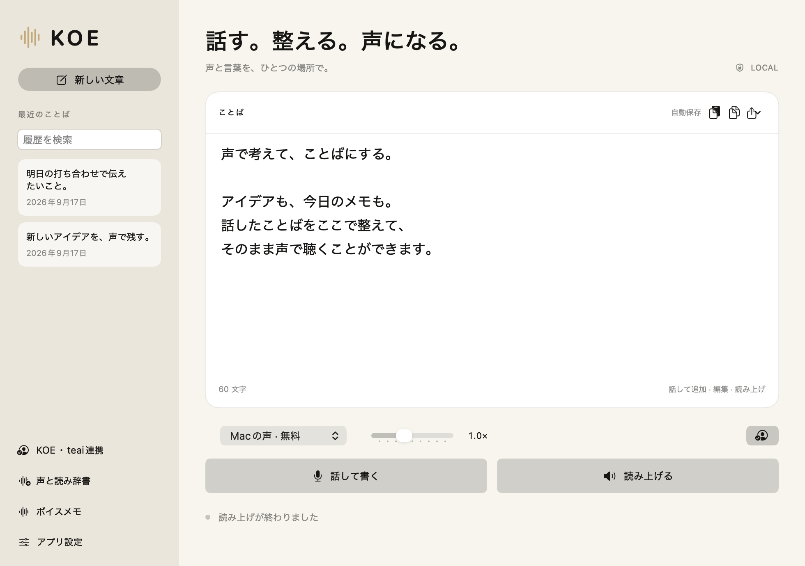
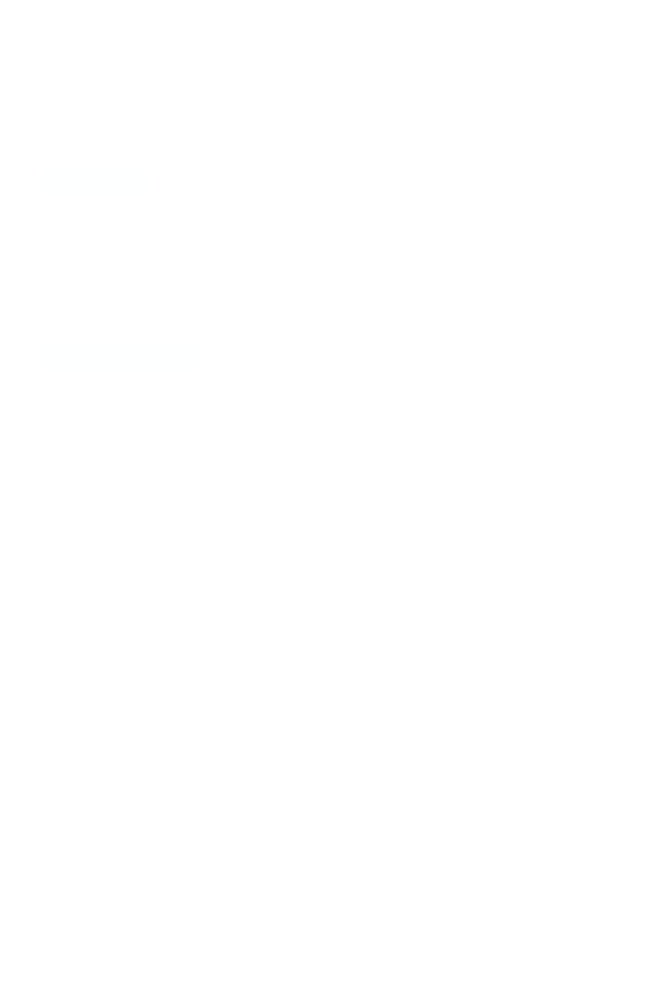
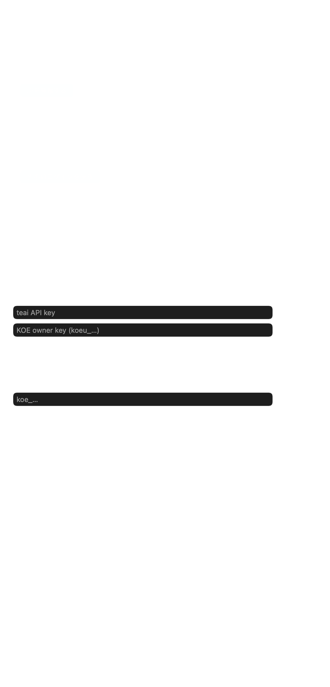
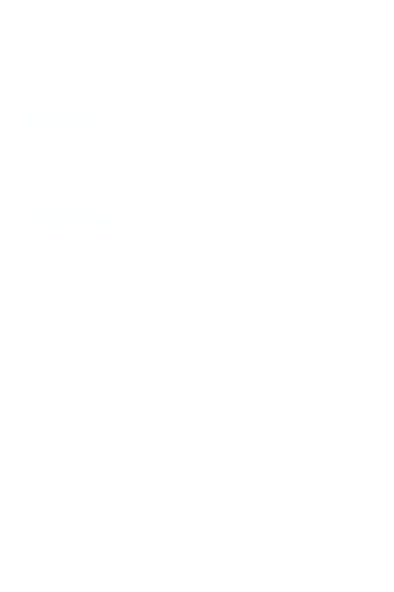

<div align="center">

# 声 Koe

**話す。整える。声になる。ローカル音声入力と、選べるクラウド本人声。**
*Speak. Edit. Listen. Local dictation with optional cloud voice.*


**[koe.elio.love](https://koe.elio.love)** — 公式サイト

[](https://github.com/yukihamada/Koe-swift/releases/latest)
[](https://github.com/yukihamada/Koe-swift/releases/latest)

</div>

---

## なにができる？

### Mac統合版の画面（ローカル開発版）

以下はこのブランチのMac版です。公開リリースへの反映は未実施です。



#### 自分の声を登録・連携

サイドバーの **KOE・teai連携** を開きます。

1. **声を登録する**：アプリ内でIDを決め、一文を録音し、内容を確認して確定します。登録済みなら **登録済みの声を接続**。
2. 登録画面上部の **この声をMacに接続** を押します。キーのコピーは不要です。
3. **先手のログインを使う**、または **teaiに登録・ログイン** でteaiを接続します。
4. 表示されたアカウントを確認して **この声をteaiに連携** → **この声を使う**。すでに連携済みなら再登録は不要です。

クラウド利用は「この声を使う」で有効になります。文章は音声生成時に送信し、生成前に料金を確認します。



#### メールで受け取ったキーを貼り付ける

**メールなどで受け取ったキーを入力** を開き、キー欄の **貼り付け** ボタン、または欄をクリックして **⌘V** を使います。

- `koeu_…`：本人声用。**KOE owner key** に貼り付けて **確認して保存**。
- `koe_…`：`mcp.koe.live` のメッセージ用。**メッセージ用キー** に貼り付けて **キーを保存**。アプリ設定にも同じ入力欄があります。
- teaiのキー：**teai API key** に貼り付けて **確認して保存**。

⌘Aで全選択して貼り直せます。キーは伏せ字で表示され、保存前には確定しません。



<details>
<summary>English: registration and connection</summary>

Open **KOE · teai accounts**. Choose **Register voice** or **Connect existing voice**, then connect teai using your existing Sente sign-in or register with teai. Confirm the accounts, link your voice, and choose **Use this voice**.

For an emailed key, expand **Enter a key received by email**. Click **Paste** or press **⌘V** in the field, then save. `koeu_…` is a voice owner key; `koe_…` is a separate messaging key.



</details>

Screenshots use an unsigned-in account and contain no real keys or email addresses. / 画面は未接続状態で撮影し、実キー・メールアドレスを含めていません。

| 機能 | 説明 |
|------|------|
| ⚡ **超高速音声入力** | whisper.cpp (Metal/CUDA GPU) で 0.5秒以内に認識 |
| 🔒 **ローカル音声入力** | ローカル認識に対応。クラウド本人声・オンライン機能は任意 |
| 🌐 **20言語対応** | 日英中韓 + スペイン語・フランス語・ドイツ語ほか |
| 🖥️ **macOS & Windows** | 両プラットフォームでネイティブ動作 |
| 🎯 **ウェイクワード** `Beta` | 「ヘイこえ」で完全ハンズフリー (macOS) |
| 🤖 **LLM後処理** | chatweb.ai / OpenAI 互換 API でテキスト加工 |
| 📝 **議事録モード** | 録音を自動でタイムスタンプ付きテキストに保存 (macOS) |
| 🔤 **テキスト展開** | 「メアド」→ 「yuki@example.com」などの辞書 |
| 🎛️ **アプリ別プロファイル** | VS Code ではコード、ターミナルではコマンドに最適化 |
| 🔄 **オートアップデート** | GitHub Releases から自動更新 |

## インストール

### macOS

#### PKG版 (推奨)

1. **[Koe.pkg をダウンロード](https://github.com/yukihamada/Koe-swift/releases/latest/download/Koe.pkg)**
2. ダブルクリックしてガイドに従うだけ。Applications に自動配置されます。
3. 起動してマイク・アクセシビリティ権限を許可
4. 初回起動時に音声認識モデル (Kotoba Whisper v2.0) が自動ダウンロード

#### DMG版

1. **[Koe-Installer.dmg をダウンロード](https://github.com/yukihamada/Koe-swift/releases/latest/download/Koe-Installer.dmg)**
2. DMGを開いて `Koe.app` を Applications にドラッグ

> whisper.cpp + Metal GPU はアプリに内蔵済み。brew install は不要です。

### Windows

#### インストーラー (推奨)

1. **[Koe-Setup.exe をダウンロード](https://github.com/yukihamada/Koe-swift/releases/latest)**
2. 実行してガイドに従うだけ
3. 初回起動時に音声認識モデルを自動ダウンロード (538MB)

#### ポータブル版

1. **[koe.exe をダウンロード](https://github.com/yukihamada/Koe-swift/releases/latest)**
2. そのまま実行（インストール不要）

> NVIDIA GPU があれば CUDA で高速化。CPU でも動作します。

### ソースからビルド

```bash
# macOS
brew install whisper-cpp llama.cpp
git clone https://github.com/yukihamada/Koe-swift
cd Koe-swift && bash build.sh

# Windows
cd Koe-windows
cargo build --release              # CPU版
cargo build --release --features cuda  # CUDA GPU版
```

## 使い方

| OS | ショートカット | 動作 |
|----|--------------|------|
| macOS | **⌥⌘V** | 押している間録音 (ホールド) / 押して切替 (トグル) |
| Windows | **Ctrl+Alt+V** | トグル方式（押して開始・もう一度で停止） |

- 話し終わると **0.85秒の無音** で自動変換
- 結果はアクティブウィンドウに自動貼り付け

### 対応言語

🇯🇵 日本語 · 🇺🇸 English · 🇨🇳 中文 · 🇰🇷 한국어 · 🇪🇸 Español · 🇫🇷 Français · 🇩🇪 Deutsch · 🇮🇹 Italiano · 🇵🇹 Português · 🇷🇺 Русский · 🇮🇳 हिन्दी · 🇹🇭 ไทย · 🇻🇳 Tiếng Việt · 🇮🇩 Indonesia · 🇳🇱 Nederlands · 🇵🇱 Polski · 🇹🇷 Türkçe · 🇸🇦 العربية · 🌐 Auto

## アーキテクチャ

```
マイク → 16kHz WAV録音
  ↓
DSP前処理 (プリエンファシス + 正規化 + VAD)
  ↓
whisper.cpp (Metal GPU / CUDA GPU)
  ↓  ~0.5秒
LLM後処理 (任意: 修正/翻訳/メール文体)
  ↓
Ctrl+V / ⌘V → テキスト入力
```

---

<div align="center">

**[koe.elio.love](https://koe.elio.love)**

<sub>Built with ♥ in Tokyo · Fully local · No subscription</sub>
</div>
